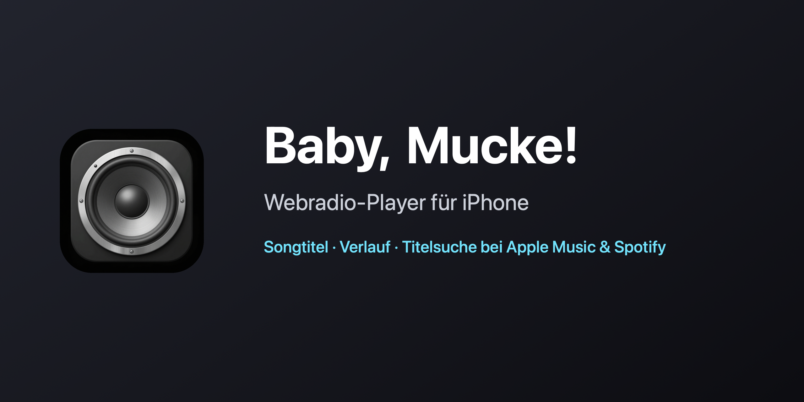
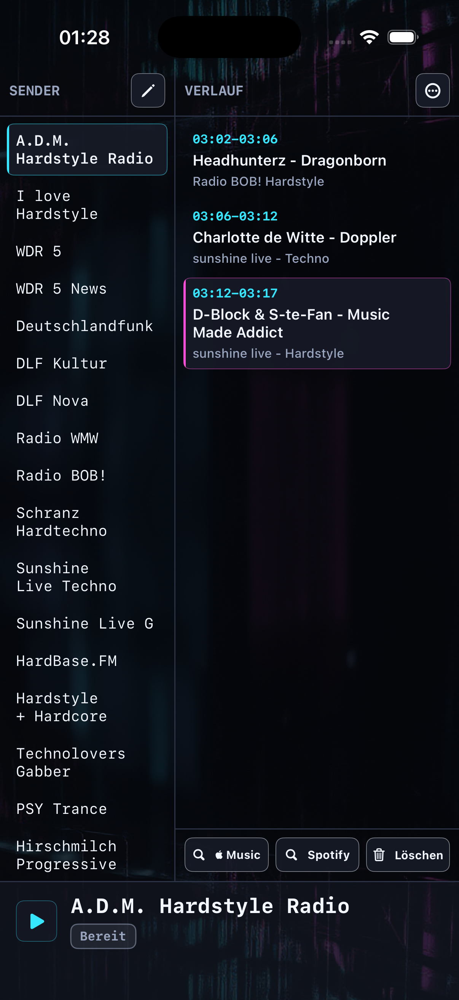

# Baby, Mucke!

**🌐 Sprache / Language:** [English](README.md) · [Deutsch](README.de.md)



Ein nativer iPhone-Internetradio-Player (SwiftUI + AVPlayer): Sender antippen und sofort hören, den laufenden Titel sehen, einen Verlauf führen und Songs mit einem Tipp bei Apple Music oder Spotify finden. Baby, Mucke! ist der iPhone-Ableger der macOS-App [Mucke, Baby!](https://github.com/DanielMuellerIR/mucke_baby).

<p align="center"></p>

## Funktionen

- **Sender antippen startet sofort.** Hintergrund-Audio mit Sperrbildschirm- und Fernbedienungs-Steuerung.
- **Live-Titel** (Interpret / Titel) über einen eingebauten ICY-Metadaten-Leser, mit korrekter Dekodierung von Nicht-UTF-8-Sendern (UTF-8 → Windows-1251 / Shift-JIS → Latin-1).
- **Verlauf** mit Start-/Endzeit je Titel und Sender, neueste Einträge unten; Einträge nach Alter löschen (älter als 1 Tag / 3 Tage / 1 Woche / 1 Monat) oder alles.
- **Ein-Tipp-Suche** für den ausgewählten Titel bei Apple Music / Spotify.
- **Sender verwalten** — anlegen, bearbeiten, löschen, plus JSON-Import / -Export; eine kuratierte Startliste ist enthalten.
- Playlist-Auflösung für `.pls` / `.m3u` / `.asx` / `.xspf`.
- **Oberfläche auf Deutsch und Englisch** (folgt der Systemsprache).

> Die Wiedergabe nutzt Apples AVFoundation und deckt damit MP3-/AAC- und HLS-Streams ab. Anders als die VLCKit-basierte macOS-App spielen manche Ogg/Opus-Sender möglicherweise nicht.

## Bauen & starten (Kommandozeile / headless-tauglich)

Der gesamte Ablauf ist skriptbar — praktisch für Automatisierung und KI-Agenten. Benötigt macOS mit installiertem Xcode.

```bash
./scripts/build-simulator.sh                          # Build für den iOS-Simulator (ohne Code-Signing)
```

In einem laufenden Simulator installieren und starten:

```bash
xcrun simctl install booted "$(find ~/Library/Developer/Xcode/DerivedData -name BabyMucke.app -path '*Debug-iphonesimulator*' | head -1)"
xcrun simctl launch booted de.babymucke.BabyMucke
```

Auf einem echten iPhone (signiert). Die Apple-**Team-ID bleibt aus dem Repo** — sie wird aus einer gitignorierten `.env` gelesen:

```bash
cp .env.example .env                                  # dann DEVELOPMENT_TEAM=XXXXXXXXXX setzen
./scripts/build-device.sh                             # baut, signiert und installiert per `xcrun devicectl`
```

Das Geräte-Skript erkennt das angeschlossene iPhone automatisch (oder `IOS_DEVICE="<Name|UDID>"` setzen). Der erste Lauf benötigt ein gekoppeltes/vertrautes Gerät und aktivierten Entwicklermodus.

## Daten

Sender und Verlauf liegen als editierbares JSON in der App-Sandbox:

```
.../Library/Application Support/BabyMucke/stations.json
.../Library/Application Support/BabyMucke/verlauf.json
```

Beim ersten Start wird die Senderliste aus der gebündelten `BabyMucke/Resources/seed-stations.json` befüllt.

## Fremdbestandteile & Lizenz

- **Keine Fremdbibliotheken** eingebettet — die Wiedergabe nutzt Apples **AVFoundation**.
- Die mitgelieferte **Senderliste** enthält nur öffentlich bekannte Stream-Adressen (reine Sachinformation, kein urheberrechtlich geschützter Inhalt); die Streams selbst gehören den jeweiligen Sendern.
- Das App-Icon wurde lokal erzeugt; die Oberfläche nutzt Systemschriften (nicht mitgeliefert).

**Lizenz:** [MIT](LICENSE).

## Voraussetzungen

iOS **17+**. Build mit Xcode 16+ auf macOS (der Simulator-Build funktioniert auch mit den Command Line Tools).

---

*Status: privates Projekt. iPhone-Ableger der macOS-App [Mucke, Baby!](https://github.com/DanielMuellerIR/mucke_baby).*
