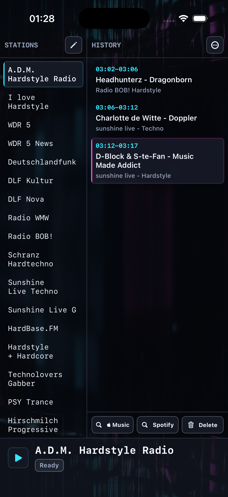

# Baby, Mucke!

**🌐 Sprache / Language:** [English](README.md) · [Deutsch](README.de.md)


A native iPhone internet-radio player (SwiftUI + AVPlayer) with a fixed "Black MIDI" look: tap a station to play instantly, see the live track title, keep a play history and look songs up on Apple Music or Spotify with one tap. It is the iPhone sibling of the macOS app [Mucke, Baby!](https://github.com/DanielMuellerIR/mucke_baby).

<p align="center"></p>

## Features

- **Tap a station to start playing instantly.** Background audio with lock-screen and remote controls.
- **Live now-playing** (artist / title) via a built-in ICY metadata reader, with correct decoding of non-UTF-8 stations (UTF-8 → Windows-1251 / Shift-JIS → Latin-1).
- **Play history** with start/end time per track and station, newest at the bottom; delete entries by age (older than 1 day / 3 days / 1 week / 1 month) or clear all.
- **One-tap Apple Music / Spotify** lookup for the selected track.
- **Manage stations** — add, edit, delete, plus JSON import / export; ships with a curated starter list.
- Playlist resolution for `.pls` / `.m3u` / `.asx` / `.xspf`.
- **UI in German and English** (follows the system language).

> Playback uses Apple's AVFoundation, so it covers MP3/AAC and HLS streams. Unlike the VLCKit-based macOS app, some Ogg/Opus stations may not play.

## Build & run (CLI / headless-friendly)

The whole flow is scriptable — handy for automation and AI agents. Requires macOS with Xcode installed.

```bash
./scripts/build-simulator.sh                          # build for the iOS Simulator (no code signing)
```

Install and launch in a booted simulator:

```bash
xcrun simctl install booted "$(find ~/Library/Developer/Xcode/DerivedData -name BabyMucke.app -path '*Debug-iphonesimulator*' | head -1)"
xcrun simctl launch booted de.babymucke.BabyMucke
```

On a real iPhone (signed). The Apple **Team ID stays out of the repo** — it is read from a gitignored `.env`:

```bash
cp .env.example .env                                  # then set DEVELOPMENT_TEAM=XXXXXXXXXX
./scripts/build-device.sh                             # builds, signs and installs via `xcrun devicectl`
```

The device script auto-detects the connected iPhone (or set `IOS_DEVICE="<name|UDID>"`). The first run needs the device paired/trusted and Developer Mode enabled.

## Data

Stations and history live in editable JSON inside the app sandbox:

```
.../Library/Application Support/BabyMucke/stations.json
.../Library/Application Support/BabyMucke/verlauf.json
```

On first launch the station list is seeded from the bundled `BabyMucke/Resources/seed-stations.json`.

## Third-party & license

- **No third-party libraries are bundled** — playback uses Apple's **AVFoundation**.
- The bundled **station list** contains only publicly known stream addresses (factual information, not copyrighted content); the streams themselves belong to their broadcasters.
- The app icon was generated locally; the UI uses system fonts (not bundled).

**License:** [MIT](LICENSE).

## Requirements

iOS **17+**. Build with Xcode 16+ on macOS (the simulator build also works with the Command Line Tools).

---

*Status: private / personal project. iPhone sibling of the macOS app [Mucke, Baby!](https://github.com/DanielMuellerIR/mucke_baby).*
